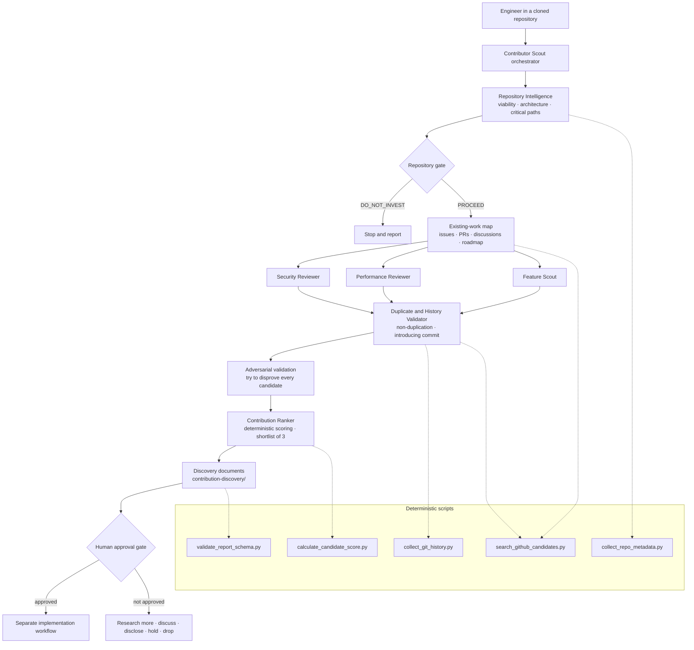

# Contributor Scout

**Evidence-first open-source contribution discovery for Claude Code.**

Point Contributor Scout at a cloned open-source repository and it will tell you
what is worth contributing — with source evidence, historical context, proof
that nobody else is already doing it, and a maintainer-facing argument for why
the change should happen.

It writes reports. It never writes code.

```text
"I want to contribute to this repository"
                 ↓
"This is the strongest opportunity, this is why it matters,
 this is why it is not duplicate work, this is why the current
 code exists, and this is how to approach the maintainers."
```

---

## Contents

- [Why it exists](#why-it-exists)
- [What it does not do](#what-it-does-not-do)
- [Core capabilities](#core-capabilities)
- [Architecture](#architecture)
- [Installation](#installation)
- [Usage](#usage)
- [Expected output](#expected-output)
- [The human workflow](#the-human-workflow)
- [Safety model](#safety-model)
- [Limitations](#limitations)
- [Troubleshooting](#troubleshooting)
- [Project structure](#project-structure)
- [Contributing](#contributing)
- [Roadmap](#roadmap)

---

## Why it exists

Writing the code is the easy part of an open-source contribution. The hard part
is deciding *what* to contribute: something technically valid, valuable to
users, aligned with where the project is going, small enough to review, and not
already being worked on by someone else.

AI assistants generate patches quickly. Without disciplined discovery they also
generate duplicate work, false security reports, unmeasured optimisations, and
speculative features — all of which land on a maintainer's desk as unpaid work.

| Common failure | Why it happens | What it costs maintainers |
|---|---|---|
| Duplicate contribution | Only issue titles searched; drafts, discussions, synonyms, recent commits missed | Time reviewing work that already exists |
| False security finding | Dangerous-looking pattern reported without reachability or mitigation analysis | Noise, or an accidental public disclosure |
| Unmeasured optimisation | Code looks slow, but the path is cold or no benchmark exists | Complexity with no user benefit |
| Random feature proposal | Capability gap inferred without demand, roadmap alignment, or maintenance cost | Scope creep and permanent support burden |
| Historically naive fix | The change ignores why the original implementation was chosen | Reintroduces solved problems |
| Oversized first PR | Unrelated refactors bundled in | Slow review, likely rejection |

Contributor Scout is designed around one principle:

> **It should be rewarded for rejecting weak ideas, not for producing findings.**
> A successful run may conclude that no contribution currently meets the
> threshold.

**Who should use it:** engineers who want to contribute to a third-party
open-source project and would rather spend an hour proving one idea is right
than a day implementing three that are wrong.

---

## What it does not do

During discovery it will not:

- modify application source code, tests, or configuration;
- implement fixes or features;
- create branches, commits, or pushes;
- open issues, create pull requests, or post comments;
- publish vulnerability details;
- run destructive commands or untrusted scripts;
- install dependencies without your approval;
- write anywhere except `contribution-discovery/`.

It also will not guarantee maintainer acceptance, replace your responsibility to
understand and defend a contribution, or formally verify a repository.

---

## Core capabilities

**Security contribution discovery** — maps the attack surface, traces
attacker-controlled input to sensitive operations, builds a threat model,
verifies reachability, checks existing mitigations, and separates severity from
contribution suitability. Findings without a complete input-to-impact chain are
rejected, not reported.

**Performance contribution discovery** — establishes that a path matters
*before* looking for inefficiency, quantifies how the cost scales, designs a
benchmark against the project's own harness, and analyses the trade-offs. No
candidate is shortlisted without a credible measurement strategy.

**Feature discovery** — starts from citable demand: roadmap items, `help wanted`
issues, maintainer statements, documented limitations, repeated user requests.
Defines the smallest viable scope and an explicit non-goals list. AI-inferred
features default to "discuss first".

**Duplicate detection** — runs twice. A broad sweep before review, and a
candidate-specific sweep afterwards using the exact symptom, file path, function
name, error string, root cause, synonyms, and proposed solution wording. Every
query is recorded, including the ones that found nothing.

**Git-history tracing** — finds the introducing commit and, where verifiable,
the introducing pull request; recovers the original design constraints; and
identifies which assumptions have since changed. History is used as explanation,
never blame.

**Maintainer-alignment analysis** — reads contribution policies, stated
non-goals, rejected proposals, and review culture, then frames the proposal in
terms the project will recognise.

**Evidence-backed scoring** — ten weighted categories and seven risk deductions,
computed by a deterministic script that also enforces the duplicate-status
gates. The model supplies judgement; the script owns the arithmetic.

**Structured reports** — a fixed 28-section candidate contract, machine-readable
JSON alongside every Markdown document, and a validator that fails a report
missing impact, evidence, duplicate status, history, tests, confidence, or a
next action.

---

## Architecture



Reviewers produce **hypotheses**. A separate validation layer tries to destroy
them before anything reaches the recommendation. Details in
[docs/architecture.md](docs/architecture.md).

---

## Installation

### Requirements

| Requirement | Needed for | Notes |
|---|---|---|
| Claude Code | Everything | Any recent version |
| Python 3.8+ | The five helper scripts | Standard library only — nothing to `pip install` |
| `git` | History tracing, repository metadata | Already required to clone the target |
| `gh` (GitHub CLI) | Duplicate detection against the remote | **Optional but strongly recommended** — without it, duplicate status can never be better than `UNKNOWN` |

```bash
python3 --version   # 3.8 or later
git --version
gh --version        # optional
```

### Option A — personal skill (recommended)

Available in every project on your machine.

```bash
git clone https://github.com/your-org/contributor-scout.git
cd contributor-scout

mkdir -p ~/.claude/skills ~/.claude/agents
cp -R skills/contributor-scout ~/.claude/skills/
cp agents/*.md ~/.claude/agents/
```

Verify:

```bash
ls ~/.claude/skills/contributor-scout/SKILL.md
ls ~/.claude/agents/ | grep -E 'security-reviewer|contribution-ranker'
```

Restart Claude Code, then run `/skills` (or ask "what skills are available?") to
confirm `contributor-scout` is listed.

### Option B — project-local

Scoped to one repository. Useful when you want the skill checked in alongside a
team's analysis conventions.

```bash
mkdir -p /path/to/target-repo/.claude/skills /path/to/target-repo/.claude/agents
cp -R skills/contributor-scout /path/to/target-repo/.claude/skills/
cp agents/*.md /path/to/target-repo/.claude/agents/
```

> Do **not** do this inside a third-party repository you intend to contribute
> to — it would add untracked files to their tree. Use Option A instead.

### Option C — plugin layout

This repository is already shaped as a Claude Code plugin: `.claude-plugin/plugin.json`
plus top-level `skills/`, `agents/`, and `hooks/`. If your Claude Code version
supports local plugin installation, point it at this directory. Otherwise use
Option A — it is equivalent in effect.

### GitHub CLI setup (optional, recommended)

```bash
gh auth login          # follow the prompts
gh auth status         # confirm authentication
```

Without authentication the skill runs in **degraded mode**: duplicate status is
capped at `UNKNOWN`, duplicate-detection confidence is `LOW`, and the scoring
script caps the non-duplication rating at 2 out of 5.

### Python setup

None required. Verify the scripts run:

```bash
python3 skills/contributor-scout/scripts/calculate_candidate_score.py --example
python3 skills/contributor-scout/scripts/validate_report_schema.py --list-required-sections
```

[`requirements.txt`](skills/contributor-scout/scripts/requirements.txt) exists to
document that there are deliberately no dependencies.

### Keeping output out of the target repository

```bash
git config --global core.excludesFile ~/.gitignore_global
echo 'contribution-discovery/' >> ~/.gitignore_global
```

The skill will not edit the target repository's `.gitignore` — that would be a
source modification.

---

## Usage

Open Claude Code from the root of a cloned open-source repository. Invoke the
skill by name (`/contributor-scout <mode>` where your Claude Code version
supports user-invocable skills) or in plain language — both work, because the
mode is just an argument.

### 1. Start with profile mode

Always run this first. It is cheap, and its answer may end the run.

```text
Use the contributor-scout skill in profile mode.
Assess whether this repository is worth contributing to.
Do not modify source code.
```

You get a viability decision — `PROCEED`, `PROCEED_WITH_LIMITATIONS`, or
`DO_NOT_INVEST` — plus an architecture map and the development commands.

### 2. Full discovery

```text
Use the contributor-scout skill in full mode.
Analyse security, performance, and feature contribution opportunities.
Generate all reports under contribution-discovery/.
Do not implement anything.
```

### Security-only review

```text
Use the contributor-scout skill in security mode.
Map the attack surface and look for reachable vulnerabilities.
Follow the repository's SECURITY.md disclosure policy.
Do not open any issue or pull request, and do not include exploit code.
```

### Performance-only review

```text
Use the contributor-scout skill in performance mode.
Focus on the request-handling path.
Every finding needs a benchmark plan and a scaling explanation.
Reject micro-optimisations.
```

### Feature-only review

```text
Use the contributor-scout skill in features mode.
Only propose features with citable demand — roadmap items, help-wanted issues,
maintainer statements, or repeated user requests.
Define the minimum viable scope and explicit non-goals for each.
```

### Validate a single candidate

```text
Use the contributor-scout skill to validate candidate PERF-001.
Try to disprove it: re-check reachability, re-run duplicate detection,
and re-score it.
```

### Refresh an older analysis

Run this immediately before you start implementing. Issues and pull requests
move.

```text
Use the contributor-scout skill in refresh mode.
Re-check issues, pull requests, and commits since the analysis date,
update duplicate status, and re-rank the candidates.
```

### Focusing a large repository

```text
Use the contributor-scout skill in performance mode,
scoped to src/parser/ and src/runtime/ only.
```

---

## Expected output

```text
contribution-discovery/
├── 00-repository-profile.md        eligibility decision, activity, policies, commands
├── 01-architecture-and-context.md  modules, data flows, trust boundaries, critical paths
├── 02-existing-work-map.md         issues, PRs, discussions, occupied vs open ground
├── 03-review-coverage.md           what was reviewed — and what was not
├── 04-candidate-scorecard.md       scores, deductions, blocking errors
├── 05-final-recommendation.md      one primary candidate, up to two alternatives
├── candidates/
│   ├── SEC-001.md
│   ├── PERF-001.md
│   ├── FEAT-001.md
│   └── REJECTED-001.md
├── evidence/
│   ├── commands-run.md
│   ├── source-locations.json
│   ├── github-searches.json
│   ├── benchmark-plan.md
│   └── unresolved-questions.md
└── machine-readable/
    ├── repository-profile.json
    ├── candidates.json
    └── final-ranking.json
```

Every material claim carries an evidence tag:

```text
[CODE]  [TEST]  [HISTORY]  [MAINTAINER]  [DOCS]  [INFERENCE]  [UNVERIFIED]
```

See [examples/](examples/) for fully worked (fictional) output, including
[a shortlisted candidate](examples/sample-candidate.md),
[a rejection](examples/sample-rejected-candidate.md), and
[a final recommendation](examples/sample-final-recommendation.md).

Format contract and JSON schemas: [docs/output-format.md](docs/output-format.md).

---

## The human workflow

Contributor Scout is one step in a longer loop. It does not close the loop.

1. **Run profile mode.** Stop here if viability is poor — that is a result, not
   a failure.
2. **Run full discovery** (or one category mode to calibrate cost first).
3. **Review the shortlisted candidates.** Read the rejections too; they often
   contain the most useful facts about the codebase.
4. **Manually verify the top candidate.** Reproduce the evidence yourself. If
   you cannot reproduce it, do not propose it.
5. **Re-check current issues and pull requests.** Use `refresh` mode. Remote
   state moves faster than your analysis.
6. **Contact maintainers** where scope or design direction is uncertain.
   "Comment and wait" is frequently the correct next action.
7. **Use a separate implementation workflow.** The approved dossier is its input.
8. **Review every changed line yourself.** You are submitting it under your name.
9. **Submit a focused pull request** — minimum scope, explicit exclusions, and a
   description a maintainer can act on.

The gate that matters most is step 4. If you cannot explain the problem, root
cause, fix, alternatives, and risks without referring to the dossier, you are
not ready to submit.

---

## Safety model

**Contributor Scout is discovery-only.** It reads, reasons, and writes reports
under `contribution-discovery/`. It does not modify the software it analyses and
does not write to GitHub.

Three independent layers enforce this:

1. **Instruction** — hard constraints in `SKILL.md` §2, repeated in every agent.
2. **Permission** — allow/ask/deny rules; see
   [hooks/settings.example.json](hooks/settings.example.json).
3. **Hook** — the optional [`discovery_guard.py`](hooks/discovery_guard.py)
   `PreToolUse` hook denies writes outside the output directory, Git state
   mutation, GitHub write commands, and destructive shell.

The hook is **not installed automatically**. Read [hooks/README.md](hooks/README.md)
first — it applies to every tool call in the session, which will block ordinary
development if you enable it globally.

Security findings get separate handling: the disclosure channel is identified in
Phase 0, materially exploitable findings are marked `PRIVATE_DISCLOSURE`, no
document contains a working exploit, and the final recommendation names the
finding without restating the vulnerable path.

Full model, including what it does **not** protect against:
[docs/safety-model.md](docs/safety-model.md).

---

## Limitations

Read these before trusting a report.

**AI false positives.** The system can produce a confident, wrong finding. The
adversarial validation phase and the evidence gates reduce this; they do not
eliminate it. Independently verify the primary candidate before acting.

**Incomplete semantic duplicate detection.** Two people can describe the same
problem with no shared vocabulary. Searching 12 query variants across issues,
PRs, and discussions is far better than title matching, and still not complete.
Always re-check manually before implementing.

**Imperfect maintainer intent.** Alignment is inferred from written artefacts.
Unwritten preferences, private discussions, and recent changes of direction are
invisible. When alignment matters, ask — that is why "comment first" is so often
the recommended action.

**Dependence on repository quality.** A project with no tests, no CONTRIBUTING,
squashed history, and an empty issue tracker gives the system very little to work
with. Reports will be correspondingly weak, and should say so.

**GitHub authentication.** Without `gh`, duplicate status cannot exceed
`UNKNOWN` and confidence stays `LOW`. Rate limits can also truncate searches on
large repositories.

**Benchmark uncertainty.** Measurements taken on a laptop are noisy and may not
reflect the maintainer's platform or a production workload. Treat magnitudes as
estimates until reproduced on CI.

**Security disclosure constraints.** The system identifies a disclosure channel
and drafts a report; it cannot judge every project's coordination norms, and it
will not send anything. Private disclosure is a human action.

**Scale.** Very large repositories cannot be reviewed exhaustively. The skill
asks you to name subsystems above roughly 5,000 files, and
`03-review-coverage.md` records what was not examined. Absence of findings in an
unreviewed area is not evidence of absence.

---

## Troubleshooting

<details>
<summary><b>GitHub CLI is not authenticated</b></summary>

```bash
gh auth status      # diagnose
gh auth login       # fix
```

The skill continues without it, in degraded mode: duplicate status `UNKNOWN`,
confidence `LOW`, non-duplication rating capped at 2. Verify duplicate status by
hand before implementing anything. Check what degraded mode recorded:

```bash
python3 -c "import json;d=json.load(open('contribution-discovery/evidence/github-searches.json'));print(d['remote_access'],d['duplicate_detection_confidence'])"
```
</details>

<details>
<summary><b>Tests cannot run</b></summary>

Expected for projects needing databases, services, or paid infrastructure. Tell
the skill:

```text
Tests cannot run locally — the suite needs a Postgres instance.
Proceed with [CODE]-only evidence and set the no_reproducible_evidence risk flag.
```

Consequence: no `[TEST]` evidence, a −20 risk deduction on affected candidates,
and a lower ceiling on `evidence_problem_real`. That is the correct outcome, not
a bug — an unreproduced finding is genuinely weaker.
</details>

<details>
<summary><b>Repository setup is incomplete</b></summary>

Do not let the skill install anything to fix it. Either build the project
manually once yourself (recommended before any run), or accept
`PROCEED_WITH_LIMITATIONS` and carry the limitation into every candidate. If the
project cannot be built at all without privileged infrastructure, that is a
legitimate `DO_NOT_INVEST`.
</details>

<details>
<summary><b>Repository is too large</b></summary>

Above roughly 5,000 source files, scope the run explicitly:

```text
Use the contributor-scout skill in performance mode, scoped to src/parser/ only.
```

Pick the scope from Phase 1's churn analysis and critical-path table — the
highest-churn directories are usually where contributions have most value.
</details>

<details>
<summary><b>Findings are too broad or vague</b></summary>

Usually means Phase 1 was too shallow — path importance and trust boundaries
were never established, so reviewers had nothing to anchor to. Re-run `profile`
mode with a narrower scope, then re-run the category mode. You can also raise the
bar directly:

```text
Only shortlist candidates with [TEST] evidence and a duplicate status of CLEAR.
```
</details>

<details>
<summary><b>Duplicate status stays UNKNOWN</b></summary>

Either `gh` is unavailable (see above), or the repository is not on GitHub.
Check the remote:

```bash
git remote -v
```

For GitLab, Codeberg, or Gitea, duplicate detection currently has no automated
path — it stays `UNKNOWN` and you must check the issue tracker manually. Host
support is on the [V4 roadmap](docs/implementation-roadmap.md).
</details>

<details>
<summary><b>Security policy is missing</b></summary>

The skill recommends a private channel anyway — GitHub private vulnerability
reporting if enabled, otherwise a maintainer email from commit history. It will
never default to a public issue for a sensitive finding. The absence of a policy
is itself worth raising with maintainers, separately and non-urgently. See
[responsible-disclosure.md](skills/contributor-scout/references/responsible-disclosure.md).
</details>

<details>
<summary><b>Reports fail schema validation</b></summary>

```bash
python3 skills/contributor-scout/scripts/validate_report_schema.py \
  --dir contribution-discovery --format json
```

Common causes: a missing mandatory section, no duplicate status, no evidence
tags, `CLEAR` combined with `LOW` confidence, no introducing-commit SHA and no
statement that history was unavailable, an empty next action, or more than three
shortlisted candidates. Fix the content — do not relax the validator. Print the
required list with `--list-required-sections`.
</details>

<details>
<summary><b>Scoring reports blocking errors</b></summary>

```bash
python3 skills/contributor-scout/scripts/calculate_candidate_score.py \
  --input contribution-discovery/machine-readable/candidates.json
```

Exit code 2 means at least one candidate is disqualified — usually a duplicate
status of `DUPLICATE`, `CLAIMED`, `REJECTED`, or `SUPERSEDED`, a missing rating,
or `CLEAR` with `LOW` confidence. Blocking errors are resolved by fixing the
candidate or rejecting it, never by overriding the script.
</details>

---

## Project structure

```text
contributor-scout/
├── README.md
├── LICENSE                          MIT
├── .gitignore
├── .claude-plugin/plugin.json       plugin manifest
├── AI_Assisted_Open_Source_Contribution_Discovery_Plan.md   design source of truth
├── skills/contributor-scout/
│   ├── SKILL.md                     workflow, hard constraints, modes, gates
│   ├── references/                  12 review playbooks (loaded per phase)
│   ├── templates/                   11 report templates
│   └── scripts/                     5 stdlib-only Python helpers
├── agents/                          6 specialised subagent definitions
├── hooks/                           optional discovery-guard hook (opt-in)
├── examples/                        worked fictional output
└── docs/
    ├── architecture.md
    ├── workflow.md
    ├── output-format.md
    ├── safety-model.md
    └── implementation-roadmap.md
```

The [planning document](AI_Assisted_Open_Source_Contribution_Discovery_Plan.md)
is the detailed design source and is kept unchanged.

---

## Contributing

Improvements to Contributor Scout itself are welcome. The most valuable ones
come from running it and recording what went wrong.

**High-value contributions**

- **Failure reports from real runs.** A false positive that survived adversarial
  validation, or a duplicate the two-pass search missed, is worth more than a new
  feature. Include the repository, the candidate, and what the system should have
  noticed.
- **Language-specific playbooks.** The current security and performance
  playbooks are ecosystem-neutral and therefore miss language-specific classes.
- **Rating-anchor calibration** based on observed maintainer outcomes.
- **Script robustness** — new manifest formats, build systems, and CI platforms
  in `collect_repo_metadata.py`.

**Ground rules**

- Update playbooks **only from observed failure patterns**, never from
  speculative complexity. The fastest way to ruin this system is to grow the
  playbooks faster than the evidence justifies.
- Keep `SKILL.md` short. Detail belongs in `references/`, loaded on demand.
- Scripts stay standard-library-only. A dependency is a permanent tax on every
  user.
- Any change to the mandatory section list must update
  `validate_report_schema.py`, `templates/candidate-finding.md`, and
  `docs/output-format.md` together.

**Before submitting**

```bash
for f in skills/contributor-scout/scripts/*.py hooks/*.py; do
  python3 -m py_compile "$f" || echo "FAILED: $f"
done
python3 skills/contributor-scout/scripts/validate_report_schema.py \
  --candidate examples/sample-candidate.md --strict
python3 skills/contributor-scout/scripts/calculate_candidate_score.py --example \
  | python3 skills/contributor-scout/scripts/calculate_candidate_score.py --input -
```

---

## Roadmap

| Version | Theme | Status |
|---|---|---|
| **V1** | Core orchestrator, review playbooks, GitHub and Git integration, templates, deterministic scoring and validation, read-only safety model | **This release** |
| **V2** | Independent adversarial validator, candidate-specific query generation, stale-candidate detection, persistent rejected-findings store, schema-versioned reports | Planned |
| **V3** | Language-specific playbooks, optional Semgrep/CodeQL/profiler integrations, framework heuristics, historical calibration | Planned |
| **V4** | Distributable plugin, published JSON Schemas, evaluation dataset linking proposals to maintainer outcomes, other repository hosts and agents | Planned |

Detail, success metrics, and the pilot plan:
[docs/implementation-roadmap.md](docs/implementation-roadmap.md).

---

## Licence

[MIT](LICENSE) © 2026 Vaibhav Vanage

---

> Contributor Scout does not optimise for the number of pull requests you open.
> It optimises for the quality of the decision that precedes one.
