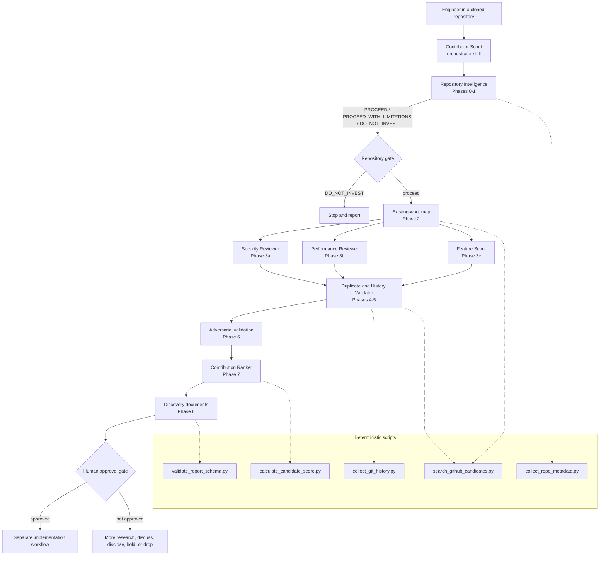

# Architecture

How Contributor Scout is put together, and why.

Design source of truth: [`AI_Assisted_Open_Source_Contribution_Discovery_Plan.md`](../AI_Assisted_Open_Source_Contribution_Discovery_Plan.md),
sections 4-5 and 15.

---

## The problem the architecture solves

A single very large skill prompt would have to hold repository comprehension,
security analysis, performance reasoning, product judgement, Git history,
duplicate detection, and report writing in one context at once. That produces
inconsistency, makes it impossible to assign different tools and permissions to
different kinds of work, and - most damagingly - lets a reviewer's own
enthusiasm carry a weak finding all the way to the recommendation.

The architecture separates **generating hypotheses** from **trying to destroy
them**, and pushes anything deterministic out of the model entirely.

---

## Component diagram



---

## Components

| Component | Responsibility | Primary output |
|---|---|---|
| Orchestrator skill | Controls phases, enforces gates, delegates, stops before implementation | Run summary, output directory |
| [Repository Intelligence](../agents/repository-intelligence.md) | Viability, architecture, policies, critical paths, conventions | `00-repository-profile.md`, `01-architecture-and-context.md` |
| [Security Reviewer](../agents/security-reviewer.md) | Reachable weaknesses with threat models and disclosure routing | `SEC-nnn.md` |
| [Performance Reviewer](../agents/performance-reviewer.md) | Measurable bottlenecks with benchmark designs | `PERF-nnn.md`, `evidence/benchmark-plan.md` |
| [Feature Scout](../agents/feature-scout.md) | Demand-backed, scope-aligned feature opportunities | `FEAT-nnn.md` |
| [Duplicate and History Validator](../agents/duplicate-history-validator.md) | Non-duplication proof and introducing-commit analysis | `02-existing-work-map.md`, history JSON, duplicate sections |
| [Contribution Ranker](../agents/contribution-ranker.md) | Falsification, dispositions, scoring, shortlist | `04-candidate-scorecard.md`, `05-final-recommendation.md` |
| Deterministic scripts | Metadata, history, searches, scoring, schema validation | JSON evidence and quality gates |

---

## Three structural decisions

### 1. Reviewers produce hypotheses, not recommendations

Each reviewer is explicitly told that its output is a hypothesis. Nothing a
reviewer writes reaches the final recommendation without passing through
adversarial validation, which is run by a different agent with a different
instruction: find the reason a maintainer would close this.

This is the single most important property of the design. A reviewer that has
spent an hour building a case is the worst possible judge of that case.

### 2. Deterministic work belongs in scripts

Arithmetic, schema completeness, and repeated searches do not benefit from model
judgement, and they degrade silently when a model improvises them. Five scripts
own that work:

- scoring cannot be hand-computed - the model supplies 0-5 ratings and risk
  flags, and the script owns the weights, the gates, and the bands;
- report completeness is checked mechanically against a fixed section list;
- duplicate-detection confidence is derived from the number of successful
  queries, not from how confident the model feels.

The scripts also make degraded modes visible. When `gh` is absent,
`search_github_candidates.py` returns `duplicate_detection_confidence: "LOW"`,
and the scoring script caps the non-duplication rating. The model cannot quietly
route around either.

### 3. Discovery and implementation never share a context

The skill has no code-writing phase. It stops at a dossier. Implementation is a
separate, explicitly authorised piece of work that reads the approved dossier as
input. This prevents the most common failure of AI-assisted contribution: a
patch that exists before anyone decided it was worth making.

---

## Progressive disclosure

`SKILL.md` holds the workflow and the hard rules - roughly 400 lines, always
loaded. Everything else is loaded only when its phase runs:

```text
SKILL.md                       always
references/*.md                per phase (12 files)
templates/*.md                 when writing a document
scripts/*.py                   executed, never read into context
agent definitions              loaded by the subagent, not the orchestrator
```

A `profile`-mode run loads two references and one template. A `full` run loads
all of them, but never simultaneously.

---

## Host packaging

The same architecture ships four times, because each host discovers skills and
agents from a different path. Nothing about the pipeline changes between them.

| Host | Skill | Agents | Hook config |
|---|---|---|---|
| Claude Code | `skills/contributor-scout/` | `agents/*.md` | `.claude/settings.json` |
| GitHub Copilot | `.github/skills/contributor-scout/` | `.github/agents/*.agent.md` | `.github/hooks/*.json` |
| Cursor | `.cursor/skills/contributor-scout/` | `.cursor/agents/*.md` | `.cursor/hooks.json` |
| Antigravity | `.agents/skills/contributor-scout/` | `.agents/agents/*.md` | `.agents/hooks.json` |

`skills/contributor-scout/` is the **canonical** tree. Within each copy,
`references/`, `templates/` and `scripts/` are byte-identical; only `SKILL.md`
frontmatter, three "where do the subagents live" sentences, and the agent
frontmatter differ. Antigravity additionally gets
`.agents/workflows/contributor-scout.md`, which is what makes
`/contributor-scout <mode>` a slash command on that host.

Four copies drift, so drift is a checked property:

```bash
python3 tools/sync_hosts.py           # report, exit 1 on drift
python3 tools/sync_hosts.py --write   # copy the canonical payload over
```

It enforces byte-identical shared subtrees, byte-identical agent bodies, and
matching `SKILL.md` section headings — the three things that must never diverge
silently. Deliberate per-host differences are left alone.

---

## Data flow between phases

```text
Phase 0  metadata JSON        -> eligibility decision
Phase 1  architecture map     -> trust boundaries, critical paths, commands
Phase 2  existing-work map    -> occupied ground, open ground, demand signals
Phase 3  raw candidates       -> hypotheses with source locations
Phase 4  history JSON         -> introducing commits, changed assumptions
Phase 5  duplicate status     -> per-candidate status + confidence
Phase 6  dispositions         -> SHORTLIST / NEEDS_MAINTAINER_INPUT / HOLD /
                                 REJECT / PRIVATE_DISCLOSURE
Phase 7  scores               -> ranked candidates with bands
Phase 8  recommendation       -> one primary, at most two alternatives
```

Each phase consumes the previous phase's *written artefact*, not its
conversational context. That is what makes `refresh` and `validate` modes
possible: they re-enter the pipeline partway through by reading the documents on
disk.

---

## Where the design deliberately stops

- **No autonomous implementation.** By construction, not by policy.
- **No remote writes.** The scripts contain no code path that can post anything;
  the subcommands are hard-coded.
- **No exhaustive verification.** The system reviews what it can and reports its
  coverage gaps. Silent partial coverage would be worse than no coverage.
- **No guarantee of acceptance.** The score estimates the probability that a
  contribution succeeds. It is a prioritisation aid, not a prediction.

---

## Related documents

- [workflow.md](workflow.md) - what each phase does, step by step
- [output-format.md](output-format.md) - the document contract and schemas
- [safety-model.md](safety-model.md) - permissions and enforcement
- [implementation-roadmap.md](implementation-roadmap.md) - V1 to V4
